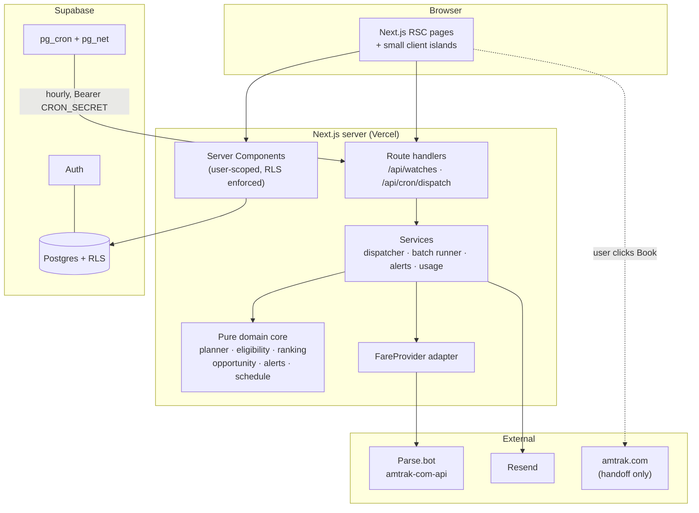
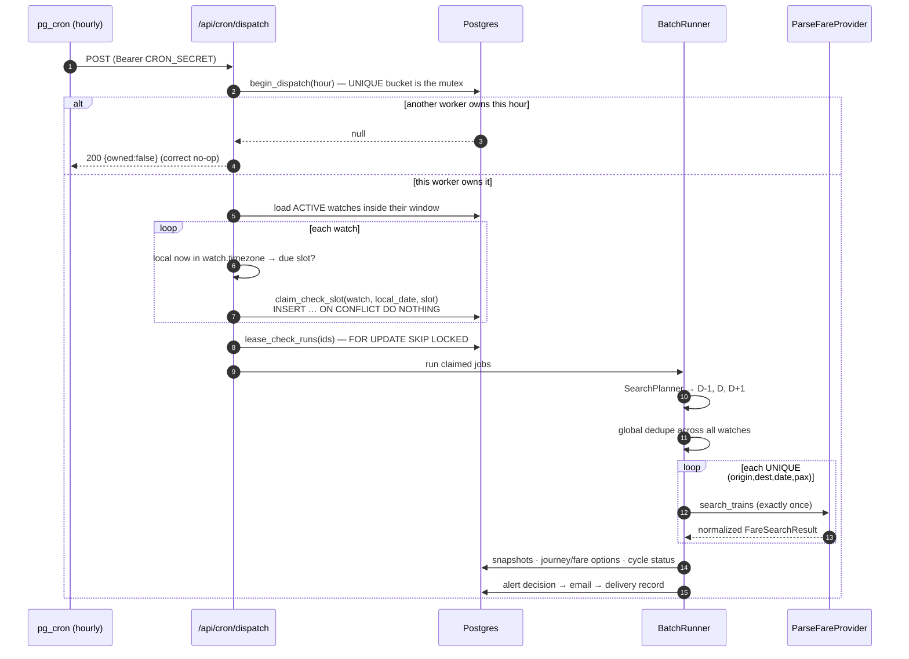
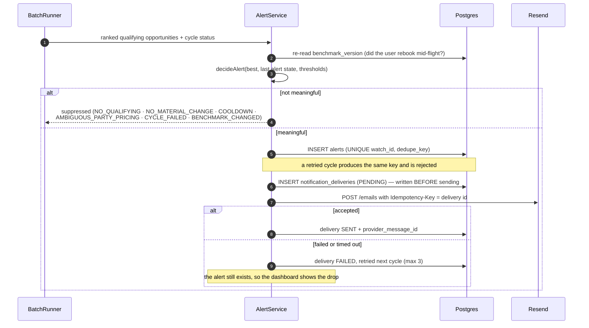
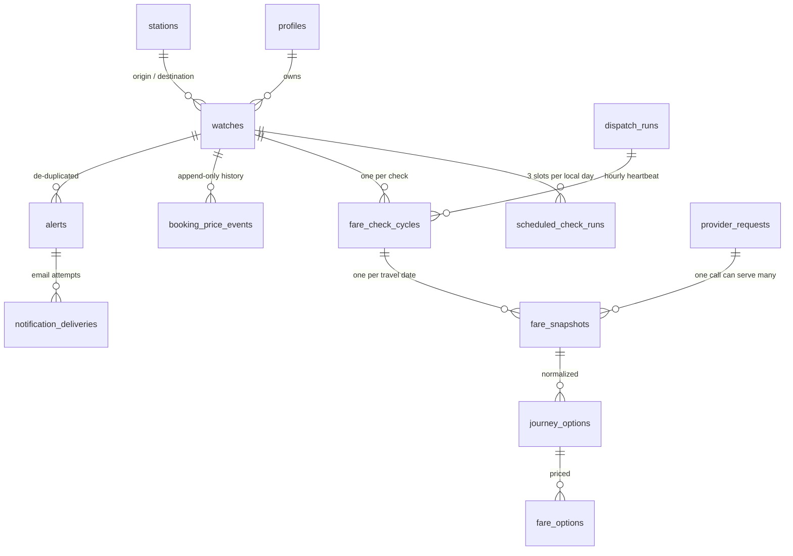
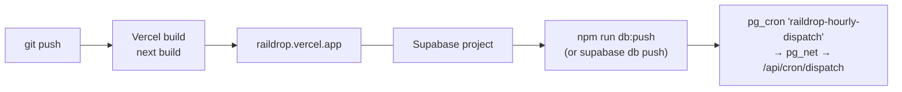

# RailDrop

**Know when your train gets cheaper.**

You already bought the Amtrak ticket. RailDrop keeps watching the same route and tells you when a
materially cheaper option appears — on your date, the day before, or the day after. It never touches
your reservation.

```
BOS → NYP        SEP 20 ±1 DAY
PAID $128    BEST NOW $74    SAVE $54
Cheapest: Sep 19 · Northeast Regional 179 · 7:05 AM
Updated 2:02 PM        Next check 8:00 PM
```

---

## Contents

- [How it works](#how-it-works)
- [System diagram](#system-diagram)
- [The check sequence](#the-check-sequence)
- [The alert sequence](#the-alert-sequence)
- [Notifications and the installable app](#notifications-and-the-installable-app)
- [Targets, timeline and what you really saved](#targets-timeline-and-what-you-really-saved)
- [Database](#database)
- [Provider abstraction](#provider-abstraction)
- [Scheduler](#scheduler)
- [Cost model](#cost-model)
- [Running locally](#running-locally)
- [Testing](#testing)
- [Deployment](#deployment)
- [Troubleshooting](#troubleshooting)

Design detail lives in [`docs/`](docs/): [ARCHITECTURE](docs/ARCHITECTURE.md) ·
[PRODUCT_SPEC](docs/PRODUCT_SPEC.md) · [TEST_PLAN](docs/TEST_PLAN.md) ·
[ADR-001 fare provider](docs/ADR-001-FARE-PROVIDER.md) · [ADR-002 scheduler](docs/ADR-002-SCHEDULER.md) ·
[ADR-003 booking handoff](docs/ADR-003-BOOKING-HANDOFF.md).

---

## How it works

1. You add a trip you have **already booked**: two stations, a date, and the amount actually on your
   receipt. That figure is the benchmark — nothing is ever estimated from it.
2. RailDrop searches your date plus the day before and after (`±1` by default), **three times a day**
   at local 08:00, 14:00 and 20:00, for as long as your monitoring window runs (48 hours by default).
3. Every eligible Amtrak option on every valid date is compared against what you paid. Your original
   train is not privileged.
4. When something is **materially** cheaper, you get one email with the cheapest alternatives ranked,
   plus a booking handoff to Amtrak. You decide whether to rebook.
5. If you rebook, tell RailDrop the new price. History is preserved and monitoring continues against
   the new benchmark.

---

## System diagram



---

## The check sequence

One user-visible "check" is a **cycle** covering the entire travel window, not a single API call.



If one of the three dates fails, the cycle is `PARTIAL_SUCCESS` and the UI names the date that could
not be checked. **A failure is never rendered as "no cheaper fare".**

---

## The alert sequence



An alert fires on the **first** qualifying drop, on a **materially lower** best price (default $5),
or when a similarly priced option becomes **materially more convenient** — e.g. $89 one day early was
already sent, and $90 on your actual date now exists.

---

## Notifications and the installable app

An alert is worth what it is worth _at the moment it arrives_. Fares move in
minutes, so RailDrop treats delivery as a first-class part of the product rather
than an afterthought bolted onto email.

**Two channels, one alert.** Every alert is a row; email and Web Push are
`notification_deliveries` rows pointing at it. A channel failing does not lose
the alert — it stays visible on `/alerts` and on the trip, and the delivery is
retried with exponential backoff. A push endpoint that returns 404/410 has been
revoked by the browser, so the subscription row is deleted instead of retried.

**Quiet hours hold; they never drop.** An alert raised at 3am inside your quiet
window is written immediately with a `deliver_after` stamp and swept out when
the window ends. The distinction matters: _held_ means you still get it, and the
sweep query filters on `deliver_after`, not on an error state.

```
alerts ──┬─ notification_deliveries (EMAIL)  PENDING → SENT
         └─ notification_deliveries (PUSH)   PENDING → FAILED → SENT (backoff)
                       ▲
                       └── deliver_after: set only by quiet hours
```

**Installable.** A manifest, a service worker and generated icons make RailDrop
a real PWA: it installs to a Home Screen or dock, opens standalone, and shows an
honest `/offline` page rather than a browser error when the network is gone. On
iOS, Web Push only works from an installed app — Settings says so rather than
offering a switch that cannot deliver.

Push is **optional**. With no VAPID keys configured the app is fully functional
and Settings reports the channel as unavailable, with the reason. See
[SETUP_REQUIRED §5](SETUP_REQUIRED.md).

```bash
npm run gen:vapid    # prints the three env lines to paste
npm run gen:icons    # regenerates the PWA icon set from the brand mark
```

**Keyboard.** ⌘K (or `/`) opens a command palette that searches your trips by
station code, city or date and jumps to any page. `g t` / `g a` / `g s` / `g u`
navigate, `n` starts a new trip, `?` lists every shortcut.

---

## Targets, timeline and what you really saved

**Target prices.** "Materially cheaper than what I paid" is the right default,
but it answers a different question from the one most people actually hold in
their head: _under this number and I'll rebook_. A target is a second,
independent reason to alert — `TARGET_REACHED` — and it fires on the **crossing**,
not on every check below the line, so a fare oscillating a dollar under your
target cannot generate an alert per check. Set one per trip, at creation or any
time after.

**A timeline, not a table.** Every trip carries a chronological record of what
actually happened: each check and its result, each alert and what it was worth,
and each thing you changed — rebooked, extended, paused, targeted. Checks and
alerts already had durable tables; `watch_events` covers the rest. It is
append-only at the database level: users can add to their history and can never
rewrite it.

**"Is this a good price?"** Every trip carries descriptive statistics over its
own observed history — lowest, usual, highest, and where today sits between
them. Deliberately **not** a prediction: it answers "is this cheap compared with
every price we have actually recorded for this trip", which the data can answer,
rather than "will it get cheaper", which it cannot. No verdict is offered at all
until five completed checks support one, and failed checks are excluded rather
than quietly thinning the sample.

**A setup checklist** points new accounts at the two settings that most change
how well RailDrop works — push notifications and a target price — because both
are invisible unless you go looking. It retires itself once done, and the push
step disappears entirely where VAPID keys are not configured, so it can never
sit permanently unfinished.

**Round trips.** Most people who buy an Amtrak ticket buy two. A round trip is
watched as **two linked watches, not one watch with two dates** — each leg keeps
its own benchmark, dates, eligible trains and alert state, because fares on the
two directions move independently and a drop on the return is worth telling you
about whether or not the outbound moved. It also means RailDrop never has to
split one combined receipt total across two legs, which would be inventing the
number this product exists not to invent. The link is symmetric, unique (a leg
belongs to at most one round trip), and `ON DELETE SET NULL`, so deleting one
leg leaves the other monitoring happily as a one-way.

**Extendable windows.** Monitoring windows were fixed at creation, so a trip
still worth watching went quiet with no recourse but to recreate it — throwing
away the price history that makes the chart worth reading. Extensions are capped
at the last travel date, because checking a train after it has departed can only
burn credits.

**Two savings numbers, side by side.**

| Savings surfaced                                                                                     | Actually saved                                                                                                           |
| ---------------------------------------------------------------------------------------------------- | ------------------------------------------------------------------------------------------------------------------------ |
| What the cheaper options we found were worth. Free to be true — it only says a cheaper fare existed. | Money that genuinely changed hands, computed from the append-only benchmark ledger: the sum of every downward rebooking. |

Only downward rebookings count, and an upward one contributes zero rather than
netting off against a real saving. The ledger is append-only under RLS, so the
figure is not a number the user can choose.

**Your data.** `Settings → Your data` exports every trip, check, alert and
delivery as one JSON file (push keys redacted — an endpoint plus its keys is a
live capability, not a record), and deletes the account outright.

---

## Database



Rules the schema enforces, verified by tests against real Postgres:

- money is **integer cents** everywhere (no `numeric`, no floats)
- every timestamp is `timestamptz`
- `UNIQUE (watch_id, local_date, check_slot)` — the exactly-once scheduling claim
- `UNIQUE (watch_id, dedupe_key)` on alerts — a retry cannot double-send
- `UNIQUE (bucket)` on `dispatch_runs` — the dispatcher mutex
- RLS on **every** table; users read only their own rows and cannot write derived data at all
- `provider_requests` / `dispatch_runs` are invisible to non-service-role connections
- every `SECURITY DEFINER` function has `EXECUTE` revoked **from `PUBLIC`**, not merely from
  `anon, authenticated` (Postgres grants to `PUBLIC` by default — revoking the roles alone leaves
  the function callable)

---

## Provider abstraction

```
FareProvider (interface)
├── ParseFareProvider         live — Parse.bot marketplace `amtrak-com-api`
├── HttpJsonFareProvider      live — ANY JSON fare API, configured by env alone
└── DeterministicFareProvider tests/E2E only — refuses to run in production
```

**There is no free, keyless source of Amtrak fares** — that is a researched finding, not an
assumption. See [docs/LIVE-FARE-SOURCES.md](docs/LIVE-FARE-SOURCES.md) for the full probe table.
`HttpJsonFareProvider` exists so that whichever key you can actually obtain drives the product
without a code change:

```bash
FARE_PROVIDER=http
HTTP_PROVIDER_URL='https://api.example.com/rail/search?from={origin}&to={destination}&date={date}'
HTTP_PROVIDER_AUTH_HEADER=Authorization
HTTP_PROVIDER_AUTH_VALUE='Bearer {key}'
HTTP_PROVIDER_KEY=...
```

Then prove it end to end:

```bash
npm run verify:live -- BOS NYP 2026-10-15
```

Provider JSON terminates at the adapter. Nothing under `src/lib/domain` may import a provider type,
and ESLint enforces it. The normalized model is `Station`, `SearchDate`, `FareSearchRequest`,
`FareSearchResult`, `Journey`, `JourneyLeg`, `Fare`, `FareFamily`, `TravelClass`, `ServiceType`,
`Availability`, `ProviderMetadata`, `BookingHandoff`.

**One `search_trains` call per (route, date, passengers).** It already returns every journey with all
fare families, so `±1` costs **3 calls**, never one per train. `get_cheapest_fare` is deliberately
unused — we need the full list anyway, so calling it first would double the spend.

**Error vs. no availability** is a first-class distinction. An empty-but-well-formed 200 is
`NO_AVAILABILITY` (a success). An unrecognisable body raises `ProviderSchemaError` and fails the date.

**Party pricing** (`PROVIDER_PRICING_BASIS`) is resolved empirically by `npm run verify:party-pricing`.
While `UNKNOWN`, single-passenger watches are safe (both interpretations agree) and multi-passenger
watches are shown but **never alerted on**.

---

## Scheduler

An **hourly heartbeat** that performs no fare searches by itself. It computes, per watch and in that
watch's own timezone, which of `08:00 / 14:00 / 20:00` is due and unclaimed, claims it durably, and
only then runs cycles. See [ADR-002](docs/ADR-002-SCHEDULER.md).

- at-least-once cron delivery → effectively-once execution (unique claim + `SKIP LOCKED` + lease)
- DST-safe: slots are local wall-clock times resolved through `Intl`, tested across both 2026 US
  transitions and non-hour offsets (+05:30, +12:45)
- only the **latest** due slot runs; older missed slots are recorded `SKIPPED`, so an outage never
  produces a burst of three cycles
- `INITIAL` and `MANUAL` checks never consume a scheduled slot

---

## Cost model

Nothing about third-party pricing is hardcoded.

| Setting                              | Default | Meaning                                      |
| ------------------------------------ | ------- | -------------------------------------------- |
| `PROVIDER_CREDITS_PER_SEARCH`        | `2`     | marketplace cost of one `search_trains` call |
| `PROVIDER_MONTHLY_CREDIT_BUDGET`     | `5000`  | your plan's monthly credits                  |
| `PROVIDER_BUDGET_SOFT_STOP_PCT`      | `0.8`   | warn on `/usage`                             |
| `PROVIDER_BUDGET_HARD_STOP_PCT`      | `1.0`   | stop calling the provider                    |
| `PROVIDER_MAX_SEARCHES_PER_DISPATCH` | `200`   | ceiling independent of budget                |
| `MANUAL_CHECK_COOLDOWN_MINUTES`      | `15`    | per watch                                    |
| `MAX_ACTIVE_WATCHES_PER_USER`        | `25`    | per user                                     |

One `±1` watch: 3 searches × 4 cycles/day (INITIAL + 3 slots) × 2 credits ≈ **24 credits/day**.
Overlapping travel windows are deduplicated globally, so two watches sharing dates cost 4 calls, not 6.
Actual spend is read from the provider's `X-Credits-Charged` header where present — the estimate is
never trusted. `/usage` shows month-to-date, projected month-end, and deduplication savings.

---

## Running locally

```bash
npm install
cp .env.example .env.local
npm run gen:cron-secret   # paste into CRON_SECRET
```

Fill in Supabase, Parse and Resend values (see [SETUP_REQUIRED.md](SETUP_REQUIRED.md)), then:

```bash
npm run db:push   # applies migrations + seeds the station catalog
npm run dev
```

### Try it with no accounts at all

```bash
npm run demo      # http://localhost:3000
```

Demo mode runs the **real** app — every page, server action, migration and
service — against an embedded PostgreSQL 17 (PGlite) and a deterministic fare
provider, with a one-click sign-in on the login page. No Supabase project, no
provider key, no email account. It is the same harness the E2E suite drives, so
what you click is what the tests assert.

It refuses to start under `VERCEL_ENV=production`, and the deterministic
provider additionally requires an explicit opt-in variable, so demo mode cannot
be reached by accident from a deployment.

---

## Testing

```bash
npm run verify          # format → lint → typecheck → unit + integration → build → secret scan
npm run test:unit       # pure domain, adapter, guards
npm run test:integration # real Postgres (PGlite): migrations, RLS, concurrency, full pipeline
npm run e2e             # Playwright against the real app with a deterministic provider
npm run visual          # the above, plus the full visual-QA sweep
```

The visual sweep is not a screenshot-diff suite — pixel baselines rot. It asserts
the things that actually break interfaces, on every key screen, at 1440 / 1024 /
768 / 390, in **both** themes:

- no horizontal overflow (and it names the offending element when there is)
- no screen silently rendering a 404
- WCAG AA contrast for every colour token against its real background
- touch targets at least 44px on mobile, swept across every signed-in surface
- a visible focus ring, and `prefers-reduced-motion` honoured

Integration tests run against a **real PostgreSQL 17** (PGlite, embedded) — the actual migrations,
the actual RLS policies, real unique-violation codes, real `FOR UPDATE SKIP LOCKED`. E2E runs the real
pages, API routes and services; only the fare provider and the session are substituted.

Two gates run after the build, alongside the secret scan:

```bash
npm run check:budget    # per-route First Load JS, gzipped, against a budget
npm run check:secrets   # no server-only names or values in any client bundle
```

Bundle regressions are invisible in review — one static import in a client
component pulls a whole SDK into the first load, nothing fails, and the page is
slower forever. `/login` reached 175 kB that way before this gate existed.
`npm run visual` additionally asserts a sound heading outline, landmarks and a
named control for every interactive element on every signed-in page.

Live checks are opt-in because they cost credits:

```bash
npm run verify:live           # ONE real search; prints every fare, runs plausibility checks
npm run probe:provider        # ONE real search; validates the schema, writes a fingerprint
npm run verify:party-pricing  # TWO real searches; resolves per-passenger vs total-party
npm run email:test -- you@example.com
npm run verify:booking-links
```

---

## Deployment



1. Create a Supabase project; set `NEXT_PUBLIC_SUPABASE_URL`, `NEXT_PUBLIC_SUPABASE_ANON_KEY`,
   `SUPABASE_SERVICE_ROLE_KEY`, `SUPABASE_DB_URL`.
2. `npm run db:push` — migrations `0001`–`0004` plus the station seed.
3. Point pg_cron at your deployment:
   ```sql
   alter database postgres set app.settings.raildrop_app_url    = 'https://your-app.vercel.app';
   alter database postgres set app.settings.raildrop_cron_secret = '<CRON_SECRET>';
   ```
   No secret is ever written into a migration file.
4. Deploy to Vercel with the same environment variables. `vercel.json` also declares an hourly Vercel
   Cron as a redundant trigger — harmless, because dispatch is idempotent.
5. `npm run db:verify` and `GET /api/health` to confirm.

---

## Troubleshooting

| Symptom                                      | Cause                                     | Fix                                                                                                      |
| -------------------------------------------- | ----------------------------------------- | -------------------------------------------------------------------------------------------------------- |
| `/api/health` reports `provider.live: false` | `FARE_PROVIDER=deterministic`             | Set `FARE_PROVIDER=parse`. Production refuses to start a non-live provider without an explicit override. |
| Dashboard says "Not checked" for a date      | provider error on that date               | Check `/usage`; the reason is on the fare strip. It will retry next cycle.                               |
| No alerts for a 2-passenger trip             | `PROVIDER_PRICING_BASIS=UNKNOWN`          | Run `npm run verify:party-pricing` and set the result. Suppression is deliberate.                        |
| Cron never runs                              | pg_cron settings missing                  | Set `app.settings.raildrop_app_url` / `raildrop_cron_secret`; Vercel Cron is the fallback.               |
| `401` from `/api/cron/dispatch`              | `CRON_SECRET` mismatch                    | Regenerate with `npm run gen:cron-secret` and update both sides.                                         |
| Emails not arriving                          | Resend unconfigured or rejecting          | `npm run email:test -- you@example.com`; check `notification_deliveries.error`.                          |
| Provider circuit open                        | 5 consecutive hard failures               | Usually a bad key or an upstream outage. It self-heals after the cooldown.                               |
| `npm run check:secrets` fails                | a server secret reached the client bundle | The output names the file and the variable. Move the access to a server module.                          |

---

RailDrop is an independent fare monitor and is not affiliated with Amtrak. It reads published fares
through a licensed marketplace API and never scrapes amtrak.com.
