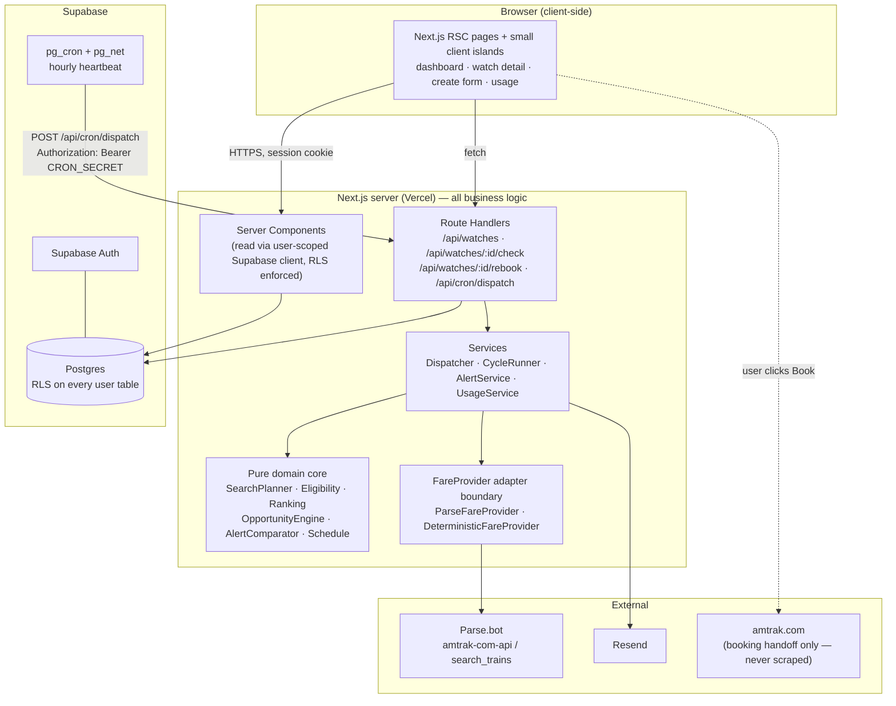
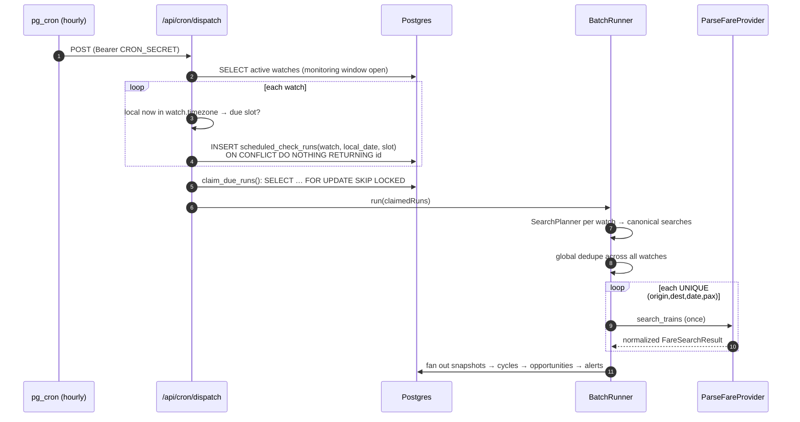
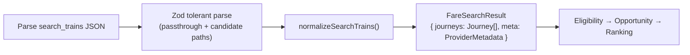
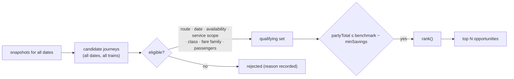
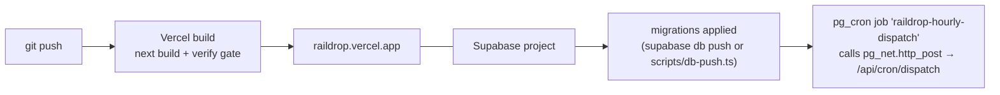

# RailDrop — Architecture

> **Know when your train gets cheaper.**
> RailDrop watches Amtrak fares _after_ you have already bought a ticket, and tells you when a
> materially cheaper option appears on your route. It never touches your reservation.

---

## 1. System overview



### Trust and placement rules

| Concern                                                 | Where it lives                                                                  | Why                                                                                            |
| ------------------------------------------------------- | ------------------------------------------------------------------------------- | ---------------------------------------------------------------------------------------------- |
| Fare provider calls                                     | **Server only** (`src/lib/providers`)                                           | `PARSE_API_KEY` must never reach a bundle; credits must be metered centrally.                  |
| Scheduling decisions                                    | **Server only** (`src/lib/services/dispatcher.ts`)                              | Needs service-role DB access and durable locks.                                                |
| Domain rules (planning, ranking, eligibility, alerting) | **Pure TypeScript**, no I/O (`src/lib/domain`)                                  | 100% unit-testable, deterministic, reusable from any caller.                                   |
| Reading a user's own data                               | **Server Components** using the _user-scoped_ Supabase client                   | RLS is the authorization boundary; the server never bypasses it for reads on behalf of a user. |
| Writing background results                              | **Service-role client** (`src/lib/db/service.ts`)                               | Only reachable from server modules guarded by `import 'server-only'`.                          |
| Rendering                                               | React Server Components by default; client islands only for interactive widgets | Keeps the client bundle small; no provider data fetching in the browser.                       |

**There is no client-side fare fetching, no polling, and no per-keystroke station API call.** Station search
runs against a locally seeded `stations` table.

---

## 2. Component responsibilities

```
src/lib/
├── domain/                 pure, no I/O, no DB, no network
│   ├── money.ts            integer-cents money type + formatting
│   ├── types.ts            the normalized domain model (Journey, Fare, …)
│   ├── search-planner.ts   watch → canonical searches (±N days, no past dates)
│   ├── dedupe.ts           global cycle-wide search deduplication
│   ├── eligibility.ts      candidate filtering rules
│   ├── ranking.ts          deterministic multi-key ordering
│   ├── opportunity.ts      benchmark − savings threshold → ranked opportunities
│   ├── alert-comparator.ts should we alert? (spam suppression)
│   ├── schedule.ts         local slots, DST-safe due-slot computation
│   └── booking-link.ts     BookingLinkResolver (3-tier resolution)
├── providers/
│   ├── fare-provider.ts    the FareProvider interface + error taxonomy
│   ├── parse/              ParseFareProvider: HTTP client, Zod schema, normalizer
│   ├── deterministic/      DeterministicFareProvider (tests/E2E only, prod-guarded)
│   └── index.ts            factory + production safety guard
├── services/               orchestration: DB + provider + email
│   ├── dispatcher.ts       hourly heartbeat → durable slot claims
│   ├── cycle-runner.ts     one cycle = all dates for one watch
│   ├── batch-runner.ts     many watches → deduplicated provider calls
│   ├── alerts.ts           alert decision → email → delivery record
│   └── usage.ts            credit accounting + budget enforcement
├── email/                  Resend transport + HTML/text templates
└── db/                     Supabase clients (browser / server / service-role)
```

---

## 3. How an active watch becomes scheduled work



**Answer: an active watch never "owns" a timer.** A stateless hourly heartbeat asks, for every active
watch, _"which local slot is due and unclaimed?"_, and a unique index makes the claim exactly-once.

---

## 4. Idempotency model

Cron delivery is **at-least-once**; execution must be **effectively-once**.

Three layers:

1. **Durable claim.** `scheduled_check_runs` has
   `UNIQUE (watch_id, local_date, check_slot)`.
   The dispatcher does `INSERT … ON CONFLICT DO NOTHING RETURNING id`. Only the invocation whose insert
   returns a row owns that slot. A second concurrent dispatcher gets zero rows and does nothing.
2. **Row lock for execution.** Claimed rows are transitioned `PENDING → RUNNING` with
   `SELECT … FOR UPDATE SKIP LOCKED`, so two workers racing on the same claimed row cannot both execute
   it — the loser skips.
3. **Lease expiry.** A `RUNNING` row older than `RUN_LEASE_MINUTES` (default 15) is reclaimable, so a
   worker that was killed mid-cycle does not wedge the slot forever. Reclaim increments `attempt`.

`INITIAL` and `MANUAL` runs are **not** slot-quota rows: they create a cycle directly with
`trigger IN ('INITIAL','MANUAL')` and `scheduled_check_run_id = NULL`. `MANUAL` is separately rate-limited
per watch (`MANUAL_CHECK_COOLDOWN_MINUTES`, default 15) so a user cannot burn credits by mashing a button.

Alerts add a fourth layer: `alerts` has `UNIQUE (watch_id, dedupe_key)` where `dedupe_key` is derived from
the alert reason plus the best-option signature, so a retried cycle cannot double-send an email.

---

## 5. Orchestrating three travel dates

`SearchPlanner.plan(watch, todayInWatchTz)` is a **pure function**:

```
dates = [desired − f … desired + f]        where f = date_flexibility_days ∈ {0,1,2}
dates = dates.filter(d => d >= todayInWatchTz)   // never search the past
searches = dates.map(d => ({ origin, destination, date: d, passengers }))
```

Calendar arithmetic is done on `YYYY-MM-DD` values with a UTC-noon anchor, so month/year rollovers
(Jan 1 → Dec 31, Feb 29) are exact and DST cannot shift a date.

One **cycle** owns all of a watch's dates. Each date becomes one `fare_snapshots` row. The cycle's status
is derived, never guessed:

| Dates succeeded | Dates failed | Cycle status      |
| --------------- | ------------ | ----------------- |
| all             | 0            | `SUCCESS`         |
| ≥1              | ≥1           | `PARTIAL_SUCCESS` |
| 0               | ≥1           | `FAILED`          |

`PARTIAL_SUCCESS` is surfaced in the UI ("Sep 21 could not be checked") and never silently rendered as
"no cheaper option found".

---

## 6. Search deduplication

The canonical key is `ORIGIN|DEST|YYYY-MM-DD|PAX`.

Deduplication happens **globally per dispatch cycle**, not per watch:

```
Watch A: BOS→NYP Sep 19,20,21 ×1
Watch B: BOS→NYP Sep 20,21,22 ×1
                    ↓ union
4 external calls: Sep 19, 20, 21, 22   (not 6)
```

`planBatch()` returns `{ uniqueSearches, assignments, savedCalls }`. `savedCalls` is persisted per dispatch
as an observability metric so we can prove the optimisation is working in production.

Within a single watch, the planner emits each date exactly once, so a watch can never generate a
3 × 3 fan-out.

---

## 7. Provider boundary and normalization

**External JSON terminates at the adapter.** Nothing under `src/lib/domain`, `src/app`, or `src/components`
may import a Parse type. This is enforced by an ESLint `no-restricted-imports` rule.



Normalized model (`src/lib/domain/types.ts`): `Station`, `SearchDate`, `FareSearchRequest`,
`FareSearchResult`, `Journey`, `JourneyLeg`, `Fare`, `FareFamily`, `TravelClass`, `ServiceType`,
`Availability`, `ProviderMetadata`, `BookingHandoff`.

`ServiceType` is a first-class normalized concept with exactly four values:
`DIRECT_RAIL`, `CONNECTING_RAIL`, `THRUWAY_BUS`, `UNKNOWN`.
A leg whose mode is a coach/bus/Thruway service is **never** labelled rail. v1 includes
`DIRECT_RAIL + CONNECTING_RAIL` by default; `THRUWAY_BUS` is excluded unless the watch sets
`include_thruway`, and is badged distinctly wherever shown. `UNKNOWN` is excluded from alerting by
default because we will not assert a mode we could not determine.

### Schema tolerance

Parse.bot publishes the endpoint contract but not a full field-level response schema. The adapter therefore:

- accepts several documented/likely container paths (`data`, `journeySolutionOption`, `journeySolutions`,
  `journeys`, `results`) via an ordered candidate walk;
- parses each journey with a **lenient** Zod schema that records which field alias matched;
- fails **loudly** (`ProviderSchemaError`) rather than returning an empty list when it cannot find a
  recognisable journey container — so a schema change is reported as a provider error, never as
  "no cheaper fares".

`npm run probe:provider` (needs a real key) dumps a sanitized field fingerprint of a live response and
writes `docs/provider-schema-fingerprint.json`, which pins the aliases actually used in production.

---

## 8. Provider error vs. no availability

This distinction is load-bearing: confusing them turns an outage into a false "no drop".

| Situation                            | HTTP | Classification                          | Cycle effect                   | User-visible                  |
| ------------------------------------ | ---- | --------------------------------------- | ------------------------------ | ----------------------------- |
| Journeys returned                    | 200  | `OK`                                    | date succeeded                 | options shown                 |
| **Zero** journeys, well-formed body  | 200  | `OK`, `journeys: []`                    | date **succeeded**             | "No availability for Sep 21"  |
| Invalid station / date gone upstream | 422  | `STALE_INPUT`                           | date failed                    | "Sep 21 could not be checked" |
| Bad/expired key                      | 401  | `AUTH`                                  | date failed, **circuit opens** | banner: provider unavailable  |
| Rate limited                         | 429  | `RATE_LIMIT` (retryable)                | retry w/ backoff, then failed  | banner                        |
| Upstream non-2xx                     | 502  | `UPSTREAM` (conditionally retryable)    | date failed                    | "could not be checked"        |
| Anti-bot block                       | 503  | `BLOCKED` (retry only if `retry_after`) | date failed                    | "could not be checked"        |
| Scraper fault                        | 500  | `PROVIDER_FAULT`                        | date failed                    | "could not be checked"        |
| Unrecognisable body                  | 200  | `SCHEMA`                                | date failed                    | "could not be checked"        |
| Network timeout                      | —    | `TIMEOUT` (retryable)                   | retry, then failed             | "could not be checked"        |

`FareSearchResult.availability` is an explicit enum — `HAS_AVAILABILITY` / `NO_AVAILABILITY` — so
downstream code can never infer emptiness from an error.

---

## 9. Pricing: party vs. per-passenger

Unverifiable assumptions about pricing basis are the single most dangerous bug in this product
(a 2-passenger benchmark compared against a 1-passenger fare "saves" 50% that does not exist).

`PricingBasis = 'PER_PASSENGER' | 'TOTAL_PARTY' | 'UNKNOWN'`, configured by `PROVIDER_PRICING_BASIS`
(default `UNKNOWN`).

Normalization computes both `amountCents` (as returned) and `partyTotalCents`:

- `TOTAL_PARTY` → `partyTotalCents = amountCents`
- `PER_PASSENGER` → `partyTotalCents = amountCents × passengers`
- `UNKNOWN` **and `passengers === 1`** → the two are arithmetically identical; marked
  `pricingConfidence: 'UNAMBIGUOUS_SINGLE'` and treated as trustworthy.
- `UNKNOWN` **and `passengers > 1`** → `pricingConfidence: 'AMBIGUOUS'`. The opportunity engine still
  computes options for display (clearly badged), but **`AlertService` refuses to send an email** and the
  cycle records `alert_suppressed_reason = 'AMBIGUOUS_PARTY_PRICING'`.

`npm run verify:party-pricing` resolves it empirically: same route/date queried with `num_adults: 1` and
`num_adults: 2`; if the 2-adult total ≈ 2× the 1-adult total the basis is `TOTAL_PARTY`, if identical it is
`PER_PASSENGER`. It prints the exact `.env` line to set. Until that is run, multi-passenger alerts stay off.

---

## 10. Computing the cheapest options



Ranking keys, in order (price is always primary):

1. `partyTotalCents` ascending
2. is the desired date (displacement 0)
3. `|dateDisplacement|` ascending
4. preferred-departure-time proximity (only if the user supplied one)
5. transfers ascending
6. duration ascending
7. fare flexibility strength descending (`FLEXIBLE > VALUE > SAVER`)
8. stable tiebreak on journey id (deterministic ordering in tests)

A one-day-early option at $59 therefore outranks an exact-date option at $120. The user's _original train_
is never privileged — every eligible Amtrak service on every valid date competes on equal terms.

---

## 11. Alert engine (anti-spam)

State carried on the watch: `last_alert_best_total_cents`, `last_alert_signature`,
`last_alert_convenience_score`, `last_alerted_at`.

An alert is generated when **any** of:

| Reason               | Condition                                                                                                                  |
| -------------------- | -------------------------------------------------------------------------------------------------------------------------- |
| `FIRST_DROP`         | no prior alert and ≥1 qualifying opportunity                                                                               |
| `PRICE_DROP`         | `best < lastBest − ALERT_MATERIAL_DROP_CENTS` (default $5)                                                                 |
| `BETTER_CONVENIENCE` | price within tolerance (`≤ lastBest + $2` **and** ≤ +3%) **and** convenience score improves by ≥ `ALERT_CONVENIENCE_DELTA` |

Convenience score rewards: displacement 0 ≫ 1 ≫ 2, fewer transfers, closer to preferred departure time,
stronger fare family. This is what makes the spec's example work: **$89 one day early** already alerted,
then **$90 on the exact desired day** appears — nominally $1 more expensive, but a materially better
convenience profile, so a second alert is justified.

Suppression guards, all of which must pass:

- identical option set + identical best price → **no alert**
- cooldown `ALERT_COOLDOWN_MINUTES` (default 60), bypassed only by a drop ≥ `ALERT_URGENT_DROP_CENTS`
- `dedupe_key` unique index — a retried cycle cannot double-send
- ambiguous party pricing → suppressed (§9)
- cycle `FAILED` → never alert; `PARTIAL_SUCCESS` → alert allowed but the email states which dates
  were not checked

---

## 12. Email failure handling

`notification_deliveries` is written **before** the send attempt (`status = 'PENDING'`), so a crash between
send and record cannot lose the fact that an email was attempted.

- Resend accepted → `SENT`, store `provider_message_id`.
- Transport error / timeout → `FAILED` with `error`, `attempt++`. Retried on the next cycle with
  exponential backoff, capped at `EMAIL_MAX_ATTEMPTS` (default 3), then `ABANDONED`.
- **Timeout after acceptance** is the dangerous case: the request may have succeeded server-side.
  Every send carries an idempotency key (`notification_deliveries.id`) passed to Resend as
  `headers['Idempotency-Key']`, so a retry of an already-accepted message is de-duplicated by Resend
  rather than delivered twice.
- The alert row is created regardless of delivery outcome, so the dashboard shows the drop even when
  email is broken, and `/dashboard` surfaces a "we couldn't email you" banner.

---

## 13. Booking handoff

RailDrop **never** modifies a reservation and never fabricates a deep link. `BookingLinkResolver` resolves
in strict priority order:

1. **Provider-supplied booking URL** — used only if present in the normalized payload _and_ it passes
   `isSafeAmtrakUrl()` (https, host exactly `amtrak.com` or `*.amtrak.com`). Confidence `EXACT`.
2. **Officially supported, browser-verified Amtrak search deep link** — only enabled when
   `AMTRAK_DEEPLINK_VERIFIED=true`, which is set exclusively by `npm run verify:booking-links` after it
   has actually driven a browser to the URL and confirmed the claimed prefill. Confidence `SEARCH_PREFILL`.
3. **Generic official handoff** to `https://www.amtrak.com/home` (verified reachable), with the full trip
   context — route, date, train, time, class, fare family, observed price and observation timestamp —
   preserved _inside RailDrop_ on a transition panel plus a **Copy trip details** action.
   Confidence `GENERIC`.

The UI never claims a generic URL points at exact inventory. Copy for tier 3 reads: _"We'll send you to
Amtrak's booking page — enter these details to find this fare."_ See `docs/ADR-003-BOOKING-HANDOFF.md`.

---

## 14. Secrets

| Secret                      | Scope  | Guard                                                                         |
| --------------------------- | ------ | ----------------------------------------------------------------------------- |
| `PARSE_API_KEY`             | server | only imported by `src/lib/providers/parse/*`, which is `import 'server-only'` |
| `SUPABASE_SERVICE_ROLE_KEY` | server | only in `src/lib/db/service.ts` (`server-only`)                               |
| `RESEND_API_KEY`            | server | only in `src/lib/email/transport.ts` (`server-only`)                          |
| `CRON_SECRET`               | server | compared with `timingSafeEqual` in `/api/cron/dispatch`                       |

Only `NEXT_PUBLIC_*` values may be read in client components. Enforcement is three-layered:

1. `src/lib/env.ts` splits `serverEnv` (guarded by a runtime "you imported this in the browser" throw)
   from `publicEnv`.
2. ESLint `no-restricted-imports` blocks `src/lib/db/service`, `src/lib/providers/*`, `src/lib/email/*`
   from `src/components/**`.
3. `npm run check:secrets` greps the built `.next` client chunks for every secret's _value_ and for the
   literal secret names, and **fails the build** on a hit. This runs in `npm run verify`.

---

## 15. Runaway-credit prevention

Credits are a first-class, configurable constraint. Nothing about third-party pricing is hardcoded.

- `PROVIDER_CREDITS_PER_SEARCH` (default `2`, matching the marketplace listing at time of writing)
- `PROVIDER_MONTHLY_CREDIT_BUDGET` (default `5000`)
- `PROVIDER_BUDGET_SOFT_STOP_PCT` (default `0.8`) → warn banner + usage page alert
- `PROVIDER_BUDGET_HARD_STOP_PCT` (default `1.0`) → **scheduled** cycles refuse to call the provider and
  record `SKIPPED_BUDGET`; `MANUAL` cycles are refused with a clear message
- `PROVIDER_MAX_SEARCHES_PER_DISPATCH` (default `200`) — a hard ceiling per heartbeat, independent of budget
- `MANUAL_CHECK_COOLDOWN_MINUTES` (default `15`) per watch
- `MAX_ACTIVE_WATCHES_PER_USER` (default `25`)
- bounded retries (max 2) with exponential backoff + full jitter, only for `RATE_LIMIT`, `TIMEOUT`,
  `UPSTREAM`, and `BLOCKED`-with-`retry_after`
- a **circuit breaker**: after `PROVIDER_CIRCUIT_FAILURES` (default 5) consecutive hard failures the
  provider is marked open for `PROVIDER_CIRCUIT_COOLDOWN_MINUTES` (default 30) and no calls are made
- real spend is recorded from the `X-Credits-Charged` response header when present, falling back to the
  configured estimate, so the usage page shows _actual_ consumption, month-to-date and projected

`/usage` renders: requests, success/failure split, credits charged, dedup savings, month-to-date vs.
budget, projected month-end, and per-status latency percentiles.

---

## 16. Deployment



- Next.js on **Vercel**; Postgres/Auth/Cron on **Supabase**.
- Migrations are plain, ordered, idempotent SQL in `supabase/migrations/`, applicable by
  `supabase db push` **or** by `npm run db:push` (a dependency-free `postgres`-over-HTTP applier that only
  needs `SUPABASE_DB_URL`), so no CLI is strictly required.
- `supabase/migrations/0004_cron.sql` installs the hourly job. The endpoint URL and `CRON_SECRET` are read
  from Postgres settings (`app.settings.raildrop_app_url`, `app.settings.raildrop_cron_secret`) so the
  secret is never inlined into a migration file.
- `vercel.json` additionally declares an hourly Vercel Cron as a **redundant** trigger — harmless because
  dispatch is idempotent, and it keeps the product alive if pg_net is unavailable on the plan.
- Health endpoint `/api/health` reports DB reachability, provider circuit state, and budget headroom.

---

## 17. Failure matrix (designed and tested)

| Failure                                                                                  | Behaviour                                                                             |
| ---------------------------------------------------------------------------------------- | ------------------------------------------------------------------------------------- |
| Provider timeout                                                                         | bounded retry (2) w/ backoff+jitter → date `FAILED`, cycle `PARTIAL_SUCCESS`/`FAILED` |
| Provider 429                                                                             | honour `retry_after`, retry once, then fail the date; circuit counts it               |
| Provider 401                                                                             | no retry, circuit opens immediately, ops banner, no alerts                            |
| Provider 500                                                                             | no retry (needs API revision), date fails                                             |
| Bad schema                                                                               | `ProviderSchemaError` → date fails; **never** an empty result                         |
| Empty journeys                                                                           | success, `NO_AVAILABILITY`, shown as "no availability", no alert                      |
| Missing fare on a journey                                                                | journey kept, marked ineligible (`NO_FARE`), never priced at 0                        |
| Unknown fare family                                                                      | normalized to `UNKNOWN`, excluded from default like-for-like comparison               |
| Station error                                                                            | watch marked `NEEDS_ATTENTION`, monitoring paused, user notified in-app               |
| 1 of 3 dates fails                                                                       | `PARTIAL_SUCCESS`, other dates still ranked/alerted, UI discloses the gap             |
| Resend error                                                                             | delivery `FAILED`, retried ≤3, alert row still created, in-app banner                 |
| Database failure                                                                         | cycle left `RUNNING`; lease expiry reclaims it; dispatch returns 500 so cron retries  |
| Cron duplicate                                                                           | unique claim + `SKIP LOCKED` → second invocation is a no-op                           |
| Worker timeout                                                                           | lease expiry (15 min) reclaims the run, `attempt++`, capped at 3 then `FAILED`        |
| Expired watch                                                                            | monitoring window checked **at execution time**, not only at scheduling time          |
| Date turns past                                                                          | planner filters past dates in the watch's timezone every cycle                        |
| Benchmark changed mid-flight                                                             | cycle re-reads the benchmark at comparison time and records                           |
| `benchmark_cents` on the cycle; a rebook during flight invalidates the alert (guarded by |
| `benchmark_version`)                                                                     |
| Provider cost change                                                                     | `PROVIDER_CREDITS_PER_SEARCH` is config; real cost read from response headers         |
| Mock provider in prod                                                                    | factory **throws** unless an explicit, loud override env is set (§18)                 |

---

## 18. Self-review of the design

Each question from the brief, answered against the implementation:

1. **Can the same scheduled run execute twice?** No — unique claim + `FOR UPDATE SKIP LOCKED` + lease.
   Tested in `tests/integration/idempotency.test.ts` with concurrent dispatchers against real Postgres.
2. **Can one watch trigger 3 × 3 duplicate requests?** No — the planner emits one search per date, and
   `dedupeSearches` collapses the union. Tested.
3. **Can identical watches be deduped?** Yes — cross-watch global dedupe; 2 overlapping watches → 4 calls,
   not 6. Tested.
4. **Per-person prices?** Handled by `PricingBasis` with alert suppression while `UNKNOWN` and pax > 1 (§9).
5. **One date fails?** `PARTIAL_SUCCESS`, disclosed in UI and email.
6. **Timezone changes?** Slots are computed in the watch's IANA timezone via `Intl`; a timezone edit
   re-derives future slots and cannot retroactively duplicate a claimed `(local_date, slot)`.
7. **Monitoring expires between scheduling and execution?** Re-validated at execution; run recorded
   `SKIPPED_EXPIRED`.
8. **Email API times out after accepting?** Idempotency key on send + delivery row written first (§12).
9. **Deep-link format changes?** Tier-2 links are only used when a browser verification set
   `AMTRAK_DEEPLINK_VERIFIED=true`; otherwise the generic handoff (tier 3) is used. Degrades safely.
10. **Benchmark changed while a check is in flight?** `benchmark_version` is captured at cycle start and
    compared before alerting; a mismatch aborts the alert and requeues an immediate re-check.
11. **Station code becomes invalid?** 422 `STALE_INPUT` on every date → watch → `NEEDS_ATTENTION`, paused.
12. **Two cron workers race?** See 1 — plus `dispatch_runs.bucket` is `UNIQUE` on the truncated hour,
    so `begin_dispatch()` hands the hour to exactly one worker; the loser returns
    `{owned:false}` and does nothing. (An advisory lock was rejected: it is session-scoped, and
    over PostgREST each call is a separate pooled connection, so it could not span a dispatch.)
    A crashed owner's row is taken over only after its lease expires. Tested with concurrent
    dispatchers against real Postgres.
13. **Provider cost changes?** Config + real header-reported charges.
14. **Production accidentally enables mock data?** `createFareProvider()` throws in production unless
    `RAILDROP_ALLOW_TEST_PROVIDER === 'i-understand-this-is-not-production'`; `/api/health` reports the
    active provider; the usage page badges a non-live provider in red.

---

## 19. Post-audit hardening

An adversarial audit (nine independent lenses, each finding verified or refuted by three independent
skeptics) found defects that the original design documented as handled but did not implement. Each is
now fixed and covered by a regression test.

| Defect                                                                           | Why it mattered                                                                                                                                                                                                             | Fix                                                                                   |
| -------------------------------------------------------------------------------- | --------------------------------------------------------------------------------------------------------------------------------------------------------------------------------------------------------------------------- | ------------------------------------------------------------------------------------- |
| `/auth/callback?next=/\evil.com` passed the `startsWith('/')` guard              | WHATWG URL treats `\` as `/`, so this was an **open redirect that fires after the session cookie is set**. Duplicated in three places, each commented as safe.                                                              | One `safeNextPath()` helper that resolves and compares origins                        |
| Table-wide `grant update` on `profiles`                                          | The anon key is public by design, so any signed-up user could set `profiles.email` to an arbitrary address and make RailDrop mail it from its verified sender — **an authenticated mail relay**                             | Column-level grant: `update (display_name, timezone)` only                            |
| `create extension pg_cron with schema extensions`                                | pg_cron 1.5+ is not relocatable; this **aborted `db:push` on a fresh project**, so the station seed never ran. Never caught because the test harness skipped that migration.                                                | Guarded `DO` blocks, and the harness now runs every migration                         |
| Alert dedupe key carried no benchmark identity                                   | After a rebook the alert state resets, the same fare re-enters `FIRST_DROP`, the key collides with the pre-rebook alert, the insert is rejected and the state never advances — **a real drop suppressed silently, forever** | Key includes `benchmark_version`                                                      |
| Month-to-date credits summed row-by-row in JS                                    | PostgREST silently caps at `max-rows`, so past ~1000 calls/month the total froze and the **budget hard stop could never fire**                                                                                              | Aggregated in Postgres via `provider_usage_since()`                                   |
| `lease_check_runs` only ever saw ids claimed in the same dispatch                | A worker killed mid-cycle stranded its run in `RUNNING`; the next heartbeat saw the row exist and refused the slot, so **the check was silently lost**. §17's reclaim path was unreachable.                                 | `reclaim_stale_runs()`, plus `complete_check_run` fenced on `attempt`                 |
| Manual-check cooldown was read-then-act across a whole provider round trip       | A double-click charged the provider twice and could send two emails                                                                                                                                                         | `claim_manual_check()` — the reservation and the guard are one statement              |
| Dispatch had no clock                                                            | A degraded-but-healthy provider could exceed Vercel's `maxDuration`, so `finish_dispatch` never ran and the run sat `RUNNING` with no metrics and no error                                                                  | Wall-clock deadline; over-capacity runs return to `PENDING`                           |
| `retryPendingDeliveries` filtered `status='FAILED'` only                         | A process that died mid-send left the row `PENDING` forever while the alert state had already advanced — **the user is never told about that drop**                                                                         | Retries `PENDING` too, with exponential backoff                                       |
| Eligibility validated a journey against the union of all searched dates          | An overnight service returned by the Sep 20 search has `travelDate` Sep 21; it was admitted, tagged with Sep 20's displacement, won the exact-date tiebreak and was labelled "Same day"                                     | Validated against the date actually searched                                          |
| Active-watch cap was not a spend ceiling                                         | create → scan → delete → repeat reset the cap every time while still charging                                                                                                                                               | Per-user search ceiling counted from cycles, which deleting does not undo             |
| Every CLI script crashed on `import 'server-only'`, and none loaded `.env.local` | **Every command in SETUP_REQUIRED.md was unrunnable**                                                                                                                                                                       | `tsconfig.scripts.json` aliases the module; a small loader reads `.env.local`         |
| `check:secrets` value scan was vacuous                                           | It compared against an empty environment, so a leaked secret **value** reported PASS                                                                                                                                        | Env is loaded; the detector is self-tested against a string known to be in the bundle |
| A `loading.tsx` Suspense boundary on the watch route                             | After a mutation the server rendered the new value every time and the browser intermittently kept the old one — a user who had just rebooked still saw their previous price ~⅓ of the time                                  | Boundary removed; mutations moved to Server Actions                                   |

## 20. Observability

Structured JSON logs (`src/lib/log.ts`) with correlation IDs on every line:
`dispatch_id`, `cycle_id`, `provider_request_id`, `notification_id`, `watch_id`.

Recorded per dispatch: watches considered, runs claimed, unique searches, **deduplication savings**,
provider requests by status, credits charged, cycle duration, per-date duration, journeys returned,
qualifying opportunities, alerts generated, emails sent, errors by kind.

## 21. Notification layer (0006)

An alert and its delivery are separate rows, and that separation is the whole
design. `alerts` is the fact — the drop happened, at this price, against this
benchmark. `notification_deliveries` is an attempt to tell you about it, one row
per channel. Nothing about a failed attempt can erase the fact.

```
alerts (1) ─── (n) notification_deliveries
                     channel: EMAIL | PUSH
                     status:  PENDING → SENT
                              PENDING → FAILED → … → ABANDONED
                     deliver_after: quiet-hours release time (nullable)
```

**Quiet hours hold rather than suppress.** `heldUntil()` is pure and lives in
`src/lib/domain/quiet-hours.ts`, so the wrap-around case (22:00 → 07:00) is
tested as arithmetic rather than observed in production. When a window is
active, the delivery row is written immediately with `deliver_after` set; the
retry sweep filters on that column. A held alert is therefore indistinguishable
from a queued one — never from a dropped one.

**Push subscriptions are capability URLs.** Anyone holding the endpoint can
notify that device, so the table is RLS-scoped like any other user data, `anon`
holds no grant on it at all, and the endpoint is `unique` so a browser
re-registering the same device updates its keys in place. A push service
answering 404 or 410 has revoked the subscription: the row is deleted, not
retried. Four consecutive failures do the same.

**Push is optional and says so.** With no VAPID keys the Settings page reports
the channel as unavailable and explains why, rather than rendering a switch that
silently delivers nothing. On iOS it additionally explains that Web Push only
works from an installed app.

### Retention

Deleting a trip is a soft delete: the row keeps its irreplaceable price history
and an Undo restores it in place. `prune_deleted_watches(keep_days)` removes
rows past the window, and the restore path updates only rows that are still
deleted — which makes a second Undo a no-op instead of a resurrection.

## 22. Second-pass findings

The audit in §19 was about correctness under load. This pass was about what
breaks in a browser, and it was driven by widening the test harness rather than
by reading code.

| Found                                                                       | Why it mattered                                                                                                                              | Fix                                                                                       |
| --------------------------------------------------------------------------- | -------------------------------------------------------------------------------------------------------------------------------------------- | ----------------------------------------------------------------------------------------- |
| ICS export coerced a `Date`-typed `desired_date` with `String(...).slice()` | The calendar export returned **HTTP 500** for every trip                                                                                     | Uses the shared `toDateString` coercion                                                   |
| Command palette ranked a subsequence match equal to a literal one           | Typing `BOS` selected _Provider usage_, whose keywords happen to contain b…o…s in order — the palette confidently opened the wrong page      | Scored: prefix > substring > keyword > subsequence                                        |
| The header nav could not fit 390px                                          | Five inline items overflowed the viewport, and shrinking them would have pushed tap targets below 44px                                       | Thumb-reachable bottom tab bar below `sm`; sign-out moves into Settings, where it belongs |
| `<button role="switch">` nested inside a `<label>`                          | A label with no `for` forwards activation to its first labelable descendant, so each tap fired twice and the switch snapped back             | The row itself is the control, named by `aria-labelledby`                                 |
| The visual sweep photographed `/` while signed in                           | `/` redirects to the dashboard for a signed-in user, so **the landing page was never actually captured or asserted** despite appearing to be | Captured in a signed-out context                                                          |
| `resetE2EData` did not reset profile preferences                            | A spec that saved quiet hours changed the starting state of every spec after it — the suite passed alone and failed in sequence              | Preferences reset to column defaults; `push_subscriptions` cleared                        |
| `pglite-supabase` had no `not(is)`                                          | The **entire soft-delete restore path was unreachable in E2E**, and threw where production works                                             | Implemented; unsupported operators still throw rather than silently widening a filter     |
| Touch-target and overflow assertions covered one page                       | New surfaces were unverified by construction                                                                                                 | Both sweep every signed-in surface; overflow failures now name the offending element      |

## 23. Targets, timeline and realised savings (0007)

### Target prices

A target is a **second, independent reason to alert**, evaluated before the
drop rules because it answers a different question. The comparator's ordering
matters more than the branch itself:

```
cycle failed / benchmark changed / nothing qualifying / ambiguous  → suppress
target set AND best <= target AND (never alerted OR lastBest > target) → TARGET_REACHED
first qualifying opportunity                                        → FIRST_DROP
materially cheaper than the last thing we said                      → PRICE_DROP
similar price, materially better trip                               → BETTER_CONVENIENCE
```

The third clause is the one that keeps it usable. Firing whenever the fare sits
below the target would mean an alert on every check for the rest of the week;
firing only on the **crossing** means it speaks once, and the ordinary drop
rules take over again underneath. Once `lastBest <= target`, a further alert has
to earn it the normal way.

The target is re-read from the row immediately before the decision, exactly like
the benchmark, so a target set while a cycle was in flight is honoured rather
than missed by one cycle. It is clamped below the benchmark by a database CHECK
as well as by the form: a target at or above what you paid is satisfied by the
first check and every check after it.

### Timeline

Three sources, one chronology, merged in the application rather than in a view:

| Source              | Already durable? | Covers                            |
| ------------------- | ---------------- | --------------------------------- |
| `fare_check_cycles` | yes              | every check and its outcome       |
| `alerts`            | yes              | every alert and what it was worth |
| `watch_events`      | **new**          | everything a person did           |

A union view would have coupled three independent write paths to the shape of
one list. `watch_events` is append-only where it counts: `select` and `insert`
policies exist, `update` and `delete` do not, and there is no grant for them
either — a timeline the user could edit would not be worth showing them.

### Realised savings

`realisedSavings()` walks the append-only benchmark ledger per trip in version
order and sums every **downward** step. Two rules keep the number honest:

1. An upward rebooking — a real choice people make — contributes zero. Netting
   it off would understate a genuine saving elsewhere; counting it as a saving
   would be a lie.
2. Steps are summed, not endpoints, so a trip rebooked three times contributes
   each drop, and a row arriving out of order cannot invent one.

## 24. Third-pass findings

| Found                                                                                                                          | Why it mattered                                                                                                                                                                                                           | Fix                                                                                                                                                                         |
| ------------------------------------------------------------------------------------------------------------------------------ | ------------------------------------------------------------------------------------------------------------------------------------------------------------------------------------------------------------------------- | --------------------------------------------------------------------------------------------------------------------------------------------------------------------------- |
| `authenticated` had `insert` **revoked** on `booking_price_events`, and both writers ran as the user with the result discarded | The "append-only benchmark history" was **empty in every deployment** — silently. No rebooking was ever recorded, and any figure derived from the ledger would have read zero forever                                     | Insert granted with a `WITH CHECK` pinning the row to its owner; `update`/`delete` stay revoked so append-only still means append-only. Both call sites now check the error |
| `EXTEND_OPTIONS` exported from a `'use server'` module                                                                         | A `'use server'` file may export only async functions. It compiles, typechecks and lints cleanly, then **every action in the file dies at runtime** — the symptom is a form that silently never submits                   | Moved to `src/lib/monitoring.ts`, plus a unit test that scans every `'use server'` module and is self-tested against a real offender                                        |
| `next dev` and `next start` share `.next`                                                                                      | Running the demo server while the E2E suite built corrupted the production chunk graph. It surfaces as `Cannot read properties of undefined (reading 'call')` from `webpack-runtime`, which points nowhere near the cause | `npm run demo` builds into `.next-demo` via `NEXT_DIST_DIR`, so the two can never collide                                                                                   |
| The production CSP forbids `eval`, which Fast Refresh needs                                                                    | `npm run dev` could not hot-reload and logged a CSP violation on every page                                                                                                                                               | Relaxation gated on `NODE_ENV`, with a test asserting the built policy never contains `unsafe-eval`, `ws:` or `http:`                                                       |
| A `<button role="switch">` nested inside a `<label>`                                                                           | A label with no `for` forwards activation to its first labelable descendant, so each tap fired twice and the switch snapped back                                                                                          | The row itself is the control, named by `aria-labelledby`                                                                                                                   |

## 25. Round trips (0008)

A round trip is **two watches that know about each other**, not one watch with
two dates. The alternative was tempting and wrong:

| One watch, two dates                                                                                                                         | Two linked watches                                                     |
| -------------------------------------------------------------------------------------------------------------------------------------------- | ---------------------------------------------------------------------- |
| One benchmark for two legs — so a combined receipt total has to be split, and RailDrop would be inventing the number it exists not to invent | Each leg carries the amount actually paid for it                       |
| One alert state, so a drop on the return competes with the outbound for the same cooldown and dedupe key                                     | Independent alert state per direction, which is what fares actually do |
| The search planner, eligibility, ranking and comparator all need a leg dimension threading through them                                      | Every one of them already works, unchanged                             |

`linked_watch_id` is symmetric and both rows are written together. Three
constraints carry the invariants:

- `watches_link_not_self` — a leg cannot be its own return.
- `watches_linked_unique` (partial, `where linked_watch_id is not null`) — a leg
  belongs to at most one round trip, so a third watch cannot claim an
  already-paired leg and quietly break symmetry. The predicate is what lets any
  number of one-way watches coexist.
- `on delete set null` — deleting one leg leaves the other monitoring as a
  one-way rather than cascading away a trip the user still cares about.

Creation is ordered so the outbound is never lost: it is created and charged
first, and if the return fails (the per-user cap, a bad station) the error says
the outbound is already being watched rather than rolling both back. Linking is
two `update`s, not an `upsert` — an upsert carrying only `id` and
`linked_watch_id` is an INSERT that would fail every NOT NULL column on the
table.

## 26. Performance, accessibility and health gates

Three classes of regression share a property: nothing fails, so nothing catches
them. Each now has a gate that runs in `npm run verify` or `npm run visual`.

**Bundle budget** (`npm run check:budget`). One static import of a large
dependency in a client component pulls it into the first load and the page is
simply slower forever. `/login` reached **175 kB First Load JS** that way — the
heaviest route in the app, on the first page an unauthenticated visitor ever
sees — because a ~70 kB Supabase client was imported at module scope for a call
that only happens on submit. Behind a dynamic `import()` at the point of use it
is **108 kB**, and the user pays the 70 kB only once they have actually typed an
email address. The gate measures gzipped bytes per route from
`app-build-manifest.json`, which is the same figure `next build` prints, and a
route missing from the manifest fails loudly rather than passing by measuring
nothing.

**Accessibility.** The visual sweep asserts, on every signed-in page: exactly
one visible `<h1>`, no skipped heading levels, `<main>` and `<nav>` landmarks,
an accessible name on every interactive element, `alt` or `aria-hidden` on every
image, and no positive `tabindex`. It immediately found that the trip detail
page — the most content-rich screen in the app — had **no `<h1>` at all**,
because the route line was a styled `div`.

**Scheduler staleness** (`/api/health`). The most dangerous failure this app has
is a scheduler that stops firing: every component reports healthy, no error is
raised, and no fare is ever checked again. Health now reports the last dispatch
and its age, and returns 503 once that exceeds fourteen hours — the widest gap
between scheduled slots is 20:00 → 08:00, so anything past fourteen means a slot
was missed outright. A deployment that has _never_ dispatched is reported as
such and stays green: new is not the same as broken.

## 27. Per-trip alert sensitivity

`minimum_savings_cents` existed from the first migration but was only ever set
from the profile default, so a $400 sleeper whose fares swing $40 a day and a
$19 regional whose fares swing $4 were held to the same threshold. It is now
reachable per trip, which is where the right answer actually lives, clamped at
$1,000 — above that the threshold would silence the trip rather than tune it.

## 28. Price position (descriptive, never predictive)

`priceStats()` answers one question — _where does today's fare sit among the
prices this trip has actually cost?_ — and refuses every adjacent question it
cannot answer honestly.

- **Not a forecast.** Nothing extrapolates, fits a curve, or implies a
  direction. A unit test asserts the verdict copy never contains "will",
  "expect", "predict" or "likely"; the only occurrence of "forecast" anywhere is
  the disclaimer saying it is not one.
- **A confidence floor.** No qualitative verdict below `MIN_OBSERVATIONS` (5).
  Three checks is one day; calling that "a good price" would dress noise as
  judgement. The descriptive figures — lowest, usual, highest — are still real
  and still shown.
- **Failures are excluded, not imputed.** A provider outage says nothing about
  price. Letting it thin the sample would make every verdict less trustworthy
  than it looks.
- **A flat history collapses the band** rather than pretending to a spread it
  does not have.

## 29. First-run checklist

`onboarded_at` existed from 0006 and was never used. Push notifications and
target prices are the two settings that most change how well RailDrop works and
both are invisible unless you go looking, so the dashboard now carries a
three-step checklist that retires itself on completion or dismissal.

The one non-obvious rule: **the push step is dropped entirely where VAPID keys
are not configured.** A checklist containing a step nobody can complete never
goes away, which is worse than not having one — so completion is computed over
the steps that actually apply.

## 30. The stale-session failure

Reported from the running demo: _"Could not create the watch"_ on every trip.
The cause was neither pricing nor the form.

The harness database lives in memory, so a dev-server recompile rebuilds it.
The bootstrap minted the test user with `gen_random_uuid()`, so the rebuilt
database contained a **new** user id while the browser still held the old one in
its cookie. Every insert then failed `watches_user_id_fkey`, several layers
below anything that knew about sessions, and the message the user saw said
nothing about the real problem.

Two fixes, because either alone leaves a gap:

1. **A fixed user id.** `E2E_USER_ID` is a constant, so a rebuilt database
   always matches an existing cookie. This removes the cause.
2. **The session shim validates the cookie.** An id that is not in `auth.users`
   is treated as no session and replaced with the current harness user, so a
   cookie left over from _any_ earlier database self-heals instead of producing
   an opaque foreign-key error. This removes the failure mode.

An E2E test plants a well-formed but non-existent id and asserts that creating a
trip still works.
